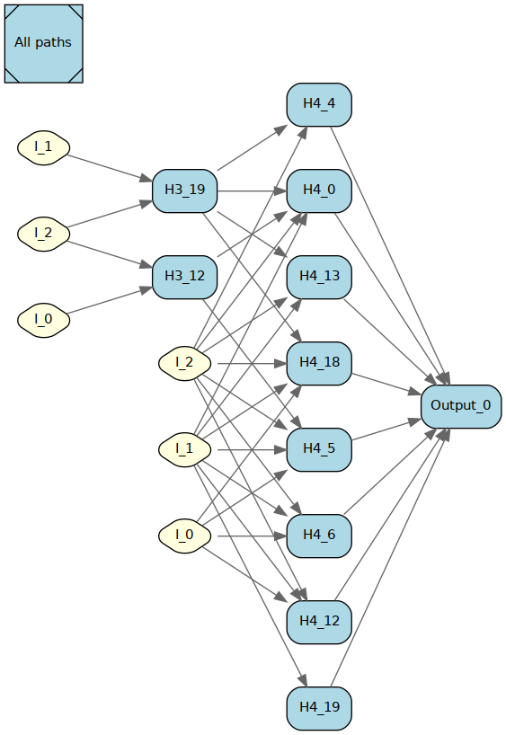
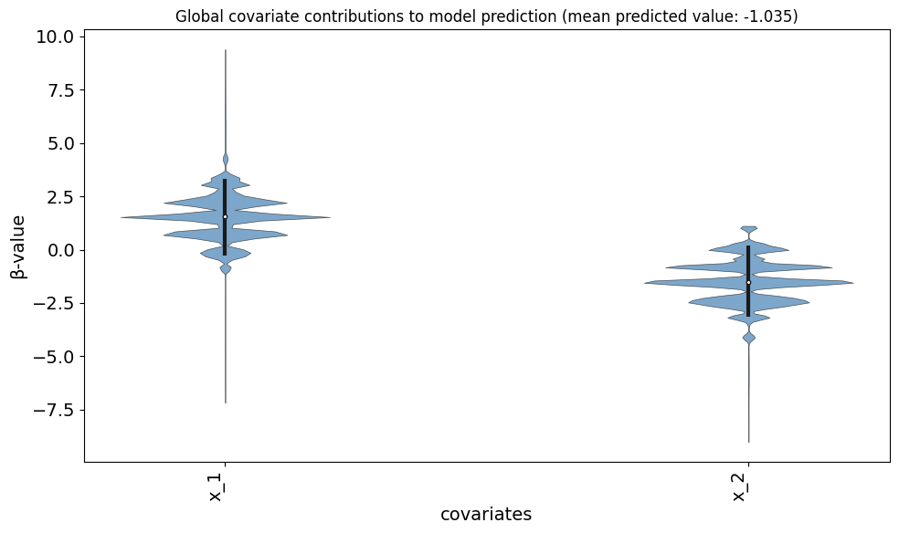
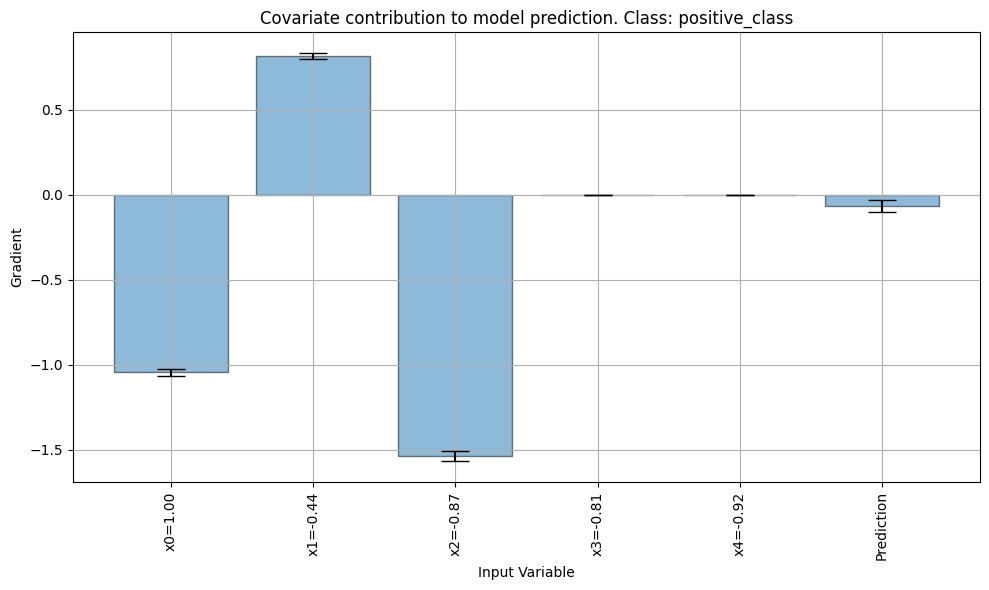
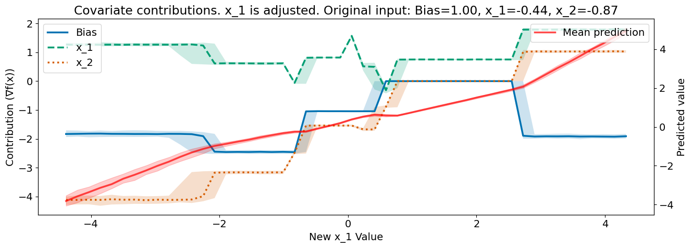

# LBBNN

Python package for **latent binary Bayesian neural networks (LBBNN)**, including both **LRT-based** and **FLOW-based** implementations with **input skip-connections**.

This repository provides implementations, utilities, and example scripts for experimenting with sparse Bayesian neural network architectures designed to support both **predictive performance** and **structural interpretability**. The repository currently includes implementations of the following model families:

- **LRT-based LBBNNs**
  - Latent binary Bayesian neural networks (LBBNNs) using the local reparameterization trick (LRT),
  - with input skip-connections to support sparse but expressive architectures.

- **FLOW-based LBBNNs**
  - Latent binary Bayesian neural networks (LBBNNs) whose weight modeling incorporates normalizing-flow components,
  - again with input skip-connections, allowing more flexible posterior structure.

- **LRT-CNN**
  - Convolutional variant of the LRT-based LBBNN

- **FLOW-CNN**
  - Convolutional variant of the FLOW-based LBBNN

In addition, the package contains utilities for:

- generating synthetic data for experimentation,
- training and validating models,
- extracting and saving global structural summaries,
- generating local contribution plots for individual observations,
- generating global explanations based on local contributions,
- and visualizing learned sparse networks.

There is also an R-package version of LBBNN, which can be found [here](https://github.com/LarsELund/LBBNN).

---

## Installation

It is recommended to install the package in a dedicated virtual environment. First clone or download the repository, then run the commands provided below.

### Create and activate a virtual environment

#### Linux / macOS

```bash
python -m venv .venv
source .venv/bin/activate
```

#### Windows PowerShell

```powershell
python -m venv .venv
.venv\Scripts\Activate.ps1
```

---

### Install in editable mode

From the repository root, install the package in editable mode:

```bash
python -m pip install --upgrade pip
python -m pip install -e ".[dev,plot,images]"
```

This is the recommended setup for development and experimentation, since changes made to the source code are immediately reflected without reinstalling the package.

---

## Running the test suite

To verify that the package is correctly installed and that the local environment is consistent with the current codebase, run:

```bash
python -m pytest -q
```

Running the test suite is strongly recommended after substantial modifications to the code.

---


## Repository status

> **This repository is under active development.**

The codebase is already usable for experimentation and methodological work, but it should still be regarded as a **research software repository** rather than a finalized production package. Interfaces, module organization, and utility functions may still evolve as the implementation is refined and expanded.

Users should therefore expect that:

- some APIs may change,
- certain helper functions may be reorganized,
- additional examples and tests may be added,
- and documentation may be expanded as the project matures.

---

## Toy Example - non-linear regression problem

To showcase the package, we will go through a simple, non-linear example. 
This [non-linear problem](examples/non_linear_examples/) has a simple structure that includes an interaction term:

$$y = -1.0 + 1.5x_1 - 1.5x_2 + 0x_3 + 0x_4 + x_1 \cdot x_2 + \epsilon$$

where $\epsilon\sim \mathcal{N}(0, 0.5^2)$.

To approximate the non-linear structure, we initate both an LRT-based and a FLOW-based LBBNN with input skip, where both have 4 hidden layers and 20 hidden nodes in each hidden layer. We will focus on the LRT based implementation below, but all results can be found [here](examples/non_linear_examples/results_non_lin/).

### Global explanations

The results after training the [LRT-based Input-Skip LBBNN](examples/non_linear_examples/run_lrt_experiment.py) can be found [here](examples/non_linear_examples/results_non_lin/lrt_run/summary.json). $R^2$ was found to be $0.95$ and the final median probability model (MPM) consist of 35 weights. The following is the MPM structure:



I\_n is the inputs, where $n=0$ inidcates the bias node, $n=1$ is $x_1$ and so on. Hl\_n is the $n^{th}$ hidden node in layer $l$, while Output\_0 is the output node. It can be noted here that neither I\_3 nor I\_4 is included in the MPM structure, meaning the model has successfully ignored them. Additionally, the first three hidden layers are not included in the MPM, leaving a much simpler structure. The initial structure had 1625 weigths, while the final MPM used 32. 

Below are some of the values associated with the connection. The full list is provided [here](examples/non_linear_examples/results_non_lin/lrt_run/connections_in_active_paths.md).

| From   | To       |      α |       w |
|:-------|:---------|-------:|--------:|
| I_1    | H4_0     | 1      | -1.1263 |
| I_2    | H4_0     | 1      |  0.9893 |
| I_0    | H4_4     | 1      |  0.2957 |
| I_1    | H4_4     | 1      | -1.4558 |
| I_2    | H4_4     | 1      | -1.2381 |
| I_0    | H4_5     | 1      | -4.2169 |
| I_1    | H4_5     | 1      | -1.699  |


Local contributions can be used to see how the covariates contributes in general:




### Local explanations

When feeding the input $\{x_0 = 1, x_1 = -0.44, x_2 = -0.87, x_3 = 0.81, x_4 = 0.92\}$ through the MPM, we get the following local contributions back:



Again, we note that both $x_3$ and $x_4$ does not contribute to the prediction. As the learned MPM structure is non-linear, we may get different contributions when providing different inputs. The figure below shows how the contributions of covariate $x_0, x_1$ and $x_2$ and the prediction changes as the value of $x_1$ change. The predictions and the covariate contributions are plotted with both the mean value and the uncertainty.




## Basic usage

The package is designed to be used as a Python library. After installation, the main components can be imported directly from `LBBNN`.

Multiple usage examples can be found in the [examples](/examples/) folder. Below are implementations for basic usage.

### Example: LRT-based network

```python
import torch
from LBBNN import BayesianNetworkLRT, create_data_unif

y, X = create_data_unif(n=64, classification=True, seed=1)

X = torch.tensor(X, dtype=torch.float32)
y = torch.tensor(y, dtype=torch.float32)

model = BayesianNetworkLRT(
    dim=8,
    p=X.shape[1],
    hidden_layers=2,
    classification=True,
    n_classes=1,
    act_func=torch.relu,
)

with torch.no_grad():
    preds = model(X, ensemble=False)

print(preds.shape)
```

---

### Example: FLOW-based network

```python
import torch
from LBBNN import BayesianNetworkFlow, create_data_unif

y, X = create_data_unif(n=64, classification=True, seed=1)

X = torch.tensor(X, dtype=torch.float32)
y = torch.tensor(y, dtype=torch.float32)

model = BayesianNetworkFlow(
    dim=8,
    p=X.shape[1],
    hidden_layers=2,
    num_transforms=2,
    classification=True,
    n_classes=1,
    act_func=torch.relu,
)

with torch.no_grad():
    preds = model(X, ensemble=False)

print(preds.shape)
print(model.kl())
```

---

### Example: LRT-based CNN

```python
import torch
from LBBNN import BayesianNetworkCNNLRT

# 1-channel 8x8 images, flattened to (N, 64)
X = torch.randn(32, 64)

model = BayesianNetworkCNNLRT(
    init_in_channels=1,
    out_channel_list=[8, 16],
    kernel_size=3,
    stride=1,
    padding=1,
    p1=8,
    p2=8,
    dim=32,
    hidden_layers=1,
    classification=True,
    n_classes=1,
    act_func=torch.relu,
)

with torch.no_grad():
    preds = model(X, ensemble=False)

print(preds.shape)   # torch.Size([32, 1])

model.train()
_ = model(X, ensemble=True)
print(model.kl())
```

---

### Example: FLOW-based CNN

```python
import torch
from LBBNN import BayesianNetworkCNNFlow

X = torch.randn(32, 64)

model = BayesianNetworkCNNFlow(
    init_in_channels=1,
    out_channel_list=[8, 16],
    kernel_size=3,
    stride=1,
    padding=1,
    p1=8,
    p2=8,
    dim=32,
    hidden_layers=1,
    num_transforms=2,
    classification=True,
    n_classes=1,
    act_func=torch.relu,
)

with torch.no_grad():
    preds = model(X, ensemble=False)

print(preds.shape)   # torch.Size([32, 1])
print(model.kl())
```

---

## Global structure and local explanation

One of the main motivations for the repository is not only to train sparse Bayesian networks, but also to inspect and interpret their learned structure.

The package includes functionality for:

- extracting global sparse structure,
- computing structural summary metrics,
- saving active network connectivity,
- producing graph-based structure visualizations,
- and generating local explanations for individual observations.

Typical imports include:

```python
from LBBNN import plotting
from LBBNN import local_explain_piecewise_linear_act
```

Example usage:

```python
metrics = plotting.get_metrics(model)
print(metrics)

x_explain = X[0]

explanation, preds, p = local_explain_piecewise_linear_act(
    net=model,
    input_data=x_explain,
    median=True,
    sample=True,
    n_samples=32,
    magnitude=True,
    include_potential_contribution=False,
    n_classes=1,
)
```

---

## Example scripts

The repository contains example scripts in the [examples](examples/) directory. These scripts are intended to provide minimal, reproducible demonstrations of how the package can be used.

Typical examples include:

- basic usage of the **LRT-based** network,
- basic usage of the **FLOW-based** network,
- basic usage of the **LRT-CNN** and **FLOW-CNN** networks,
- and usage of the plotting / explanation utilities.

Example commands:

```bash
python examples/lrt_usage.py
python examples/flow_usage.py
python examples/cnn_usage.py
python examples/plotting_demo.py
python examples/linear_examples/run_flow_experiment.py
python examples/linear_examples/run_lrt_experiment.py
python examples/image_examples/run_flow_mnist.py
python examples/image_examples/run_lrt_mnist.py
python examples/image_cnn_examples/run_flow_cnn_mnist.py
python examples/image_cnn_examples/run_lrt_cnn_mnist.py
```

These scripts may serve as a useful starting point for custom experiments, benchmark studies, or exploratory analyses.

---

## Repository structure

A representative repository structure is:

```text
LBBNN/
├── README.md
├── pyproject.toml
├── LICENSE
├── examples/
│   ├── basic_usage.py
│   ├── flow_usage.py
│   ├── cnn_usage.py
│   ├── plotting_demo.py
|   ├── abalone/
|   |   ├── run_flow_experiment.py
│   |   └── run_lrt_experiment.py
|   ├── image_cnn_examples/
|   |   ├── run_flow_cnn_cifar10.py
|   |   ├── run_flow_cnn_fmnist.py
|   |   ├── run_flow_cnn_mnist.py
|   |   ├── run_lrt_cnn_cifar10.py
|   |   ├── run_lrt_cnn_fmnist.py
│   |   └── run_lrt_cnn_mnist.py
|   ├── image_examples/
|   |   ├── run_flow_cifar10.py
|   |   ├── run_flow_fmnist.py
|   |   ├── run_flow_mnist.py
|   |   ├── run_lrt_cifar10.py
|   |   ├── run_lrt_fmnist.py
│   |   └── run_lrt_mnist.py
|   ├── wbc/
|   |   ├── run_flow_experiment.py
│   |   └── run_lrt_experiment.py
|   └── mice_protein_dataset/
|       ├── run_flow_experiment.py
│       └── run_lrt_experiment.py
├── tests/
│   ├── test_data.py
│   ├── test_lrt.py
│   ├── test_flow.py
│   ├── test_flow_transforms.py
│   ├── test_lrt_cnn.py
│   ├── test_flow_cnn.py
│   ├── test_training.py
│   ├── test_inspection.py
│   ├── test_explain.py
│   └── test_plotting.py
└── LBBNN/
        ├── __init__.py
        ├── transforms.py
        ├── data.py
        ├── inspection.py
        ├── explain.py
        ├── training.py
        ├── lrt/
        │   ├── __init__.py
        │   ├── layers.py
        │   └── network.py
        ├── lrt_cnn/
        │   ├── __init__.py
        │   ├── layers.py
        │   └── network.py
        ├── flow/
        │   ├── __init__.py
        │   ├── layers.py
        │   └── network.py
        ├── flow_cnn/
        │   ├── __init__.py
        │   ├── layers.py
        │   └── network.py
        └── plotting/
            ├── __init__.py
            ├── _common.py
            ├── graphs.py
            ├── explanations.py
            ├── images.py
            └── metrics.py
```

---

## Main modules

### Core model implementations

- `LBBNN.lrt.network`  
  LRT-based latent binary Bayesian neural network with input skip-connections.

- `LBBNN.lrt.layers`  
  LRT-based Bayesian linear layer definitions.

- `LBBNN.flow.network`  
  FLOW-based latent binary Bayesian neural network with input skip-connections.

- `LBBNN.flow.layers`  
  FLOW-based Bayesian linear layers.

- `LBBNN.lrt_cnn.network`  
  LRT-based Bayesian CNN with Bayesian convolutional layers and input skip-connections.

- `LBBNN.lrt_cnn.layers`  
  LRT-based Bayesian 2-D convolutional layer (`BayesianConv2dLRT`).

- `LBBNN.flow_cnn.network`  
  FLOW-based Bayesian CNN with flow-based convolutional layers and input skip-connections.

- `LBBNN.flow_cnn.layers`  
  FLOW-based Bayesian 2-D convolutional layer (`BayesianConv2dFlow`).

- `LBBNN.transforms`  
  Normalizing-flow components shared by the FLOW-based feed-forward and CNN models
  (`PropagateFlow`, `IAF`, `RNVP`, `MADE`).

---

### Supporting modules

- `LBBNN.data`  
  Synthetic dataset generation for experimental studies.

- `LBBNN.training`  
  Training, validation, and evaluation helpers.

- `LBBNN.inspection`  
  Utilities for structural inspection and extraction of sparse connectivity.

- `LBBNN.explain`  
  Local explanation methods.

- `LBBNN.plotting`  
  Plotting and visualization helpers for structure and explanations.

---

## Intended use

This repository is intended primarily for:

- methodological experimentation,
- reproducible research,
- analysis of sparse Bayesian neural network architectures,
- and development of interpretable Bayesian models with learned latent structure.

It may also be useful as a starting point for downstream applications where a sparse, interpretable neural network architecture is desirable.

---

## Notes on reproducibility

As with most research software, results may depend on:

- random seeds,
- hardware configuration,
- PyTorch / dependency versions,
- and specific experiment settings.

Where possible, users are encouraged to:

- set seeds explicitly,
- save model checkpoints and outputs,
- and use the provided example and experiment scripts as templates for reproducible workflows.

---

## License

This project is distributed under the **MIT License**.

---

## Citation

If you use this repository in academic research, please cite the relevant methodological paper as well as the software repository or archived software release.

The LBBNN Python package is developed based on a handful of papers.

[Sparse Bayesian Neural Networks: Bridging Model and Parameter Uncertainty through Scalable Variational Inference](https://www.mdpi.com/2227-7390/12/6/788):

```bibtex
@article{hubin2024sparse,
  title={Sparse Bayesian neural networks: bridging model and parameter uncertainty through scalable variational inference},
  author={Hubin, Aliaksandr and Storvik, Geir},
  journal={Mathematics},
  volume={12},
  number={6},
  pages={788},
  year={2024},
  publisher={MDPI}
}
```

[Sparsifying Bayesian neural networks with latent binary vari
ables and normalizing flows](https://openreview.net/pdf?id=d6kqUKzG3V):

```bibtex
@article{skaaret-lund2024sparsifying,
  title={Sparsifying Bayesian neural networks with latent binary variables and normalizing flows},
  author={Lars Skaaret-Lund and Geir Storvik and Aliaksandr Hubin},
  journal={Transactions on Machine Learning Research},
  issn={2835-8856},
  year={2024},
}
```

[Explainable Bayesian deep learning through input-skip
Latent Binary Bayesian Neural Networks](https://arxiv.org/pdf/2503.10496) (preprint):

```bibtex
@article{hoyheim2025explainable,
  title={Explainable Bayesian deep learning through input-skip Latent Binary Bayesian Neural Networks},
  author={H{\o}yheim, Eirik and Skaaret-Lund, Lars and S{\ae}b{\o}, Solve and Hubin, Aliaksandr},
  journal={arXiv preprint arXiv:2503.10496},
  year={2025}
}
```

### Software citation

```bibtex
@software{hoyheim_lbbnn,
  author       = {Eirik H{\o}yheim},
  title        = {LBBNN: Latent Binary Bayesian Neural Networks with input-skip},
  year         = {2026},
  publisher    = {GitHub},
  url          = {https://github.com/eirihoyh/LBBNN}
}
```